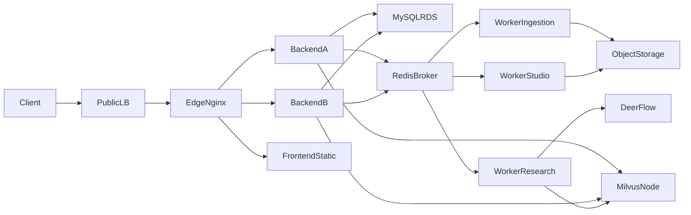

# NotebookLM Production Scaling Blueprint

## Topology

Recommended production topology without Kubernetes:

Recommended VM layout:

- `VM-1`: `SLB/Nginx` + frontend static assets
- `VM-2`: `backend_a`
- `VM-3`: `backend_b`
- `VM-4`: Celery workers
- Managed services: MySQL RDS, Redis, object storage
- Optional dedicated node: Milvus + MinIO + etcd

## Request Boundaries

Synchronous paths:

- Login, auth refresh, notebook CRUD, source metadata reads
- Chat SSE transport and lightweight request orchestration
- Task creation endpoints that only validate input and enqueue jobs

Asynchronous paths:

- Source ingestion and embedding
- Deep Research
- Mind map, slide, infographic, and report generation
- Large export or document rendering jobs

## Capacity Model

Rough estimates for `10,000` online users under heavy generation usage:

- Active users ratio: `10% - 30%`
- Active task/chat sessions: `1,000 - 3,000`
- Concurrent SSE chats: `300 - 900`
- Concurrent queued generation tasks: `800 - 2,000`
- Legacy polling load at `2.5s`: `320 - 800 RPS`

Practical planning guidance:

- Keep a single API node below `300 - 500` stable SSE connections until load tests prove otherwise
- Separate long-running workers from API nodes before increasing user traffic
- Do not share one Redis instance forever for broker, result backend, and cache under sustained generation load
- Treat Milvus as a performance-sensitive dependency and monitor its memory and flush behavior

## Bottleneck Ranking

Primary bottlenecks:

- API process saturation from SSE and long-lived connections
- Worker queue backlog from Deep Research and Studio generation
- Two-machine single points of failure at the app layer and middleware layer

Secondary bottlenecks:

- MySQL connection pool exhaustion and slow notebook/source queries
- Redis contention across broker, result storage, and cache traffic
- Milvus read/write contention during ingestion plus retrieval bursts

Tertiary bottlenecks:

- External LLM, DeerFlow, or object storage tail latency
- Incomplete health probes and missing overload protection

## Async Strategy

Implemented direction in this repository:

- Long-running jobs are queued through Celery instead of FastAPI `BackgroundTasks`
- Job types are split into dedicated queues: `ingestion`, `studio`, `research`, `general`
- Task status is published through Redis-backed task events
- Frontend prefers SSE task streams and falls back to polling when needed

Task flow:

1. API validates input and writes a pending record.
2. API publishes an initial task event and enqueues a Celery task.
3. Worker publishes `processing`, executes the job, and commits the final record.
4. Worker publishes a final `ready` or `error` event.
5. Frontend listens on `/api/task-events/.../stream` and fetches the final record once terminal.

## Service Split Guidance

Near-term split:

- Keep FastAPI as a modular monolith for synchronous API traffic
- Run separate worker pools per queue
- Keep Redis/MySQL/Milvus as independent infrastructure concerns

Later microservice candidates:

- `ingestion/indexing`
- `research-orchestrator`
- `studio-generation`
- `export/rendering`

Do not split these into separate microservices before:

- API nodes are already horizontally scalable
- Long-running jobs no longer run inside API processes
- Observability exists for queue depth, dependency health, and latency

## Validation Plan

Run at least these load tests before claiming `10k` readiness:

- SSE concurrency: `300`, `500`, `800`, `1000`
- Task submission bursts: `200`, `500`, `1000`
- Queue drain time under mixed ingestion + research + studio workloads
- Dependency fault injection: Redis unavailable, Milvus slow, DeerFlow timeout

Watch these metrics:

- API `P95/P99`, SSE connection count, socket/file descriptor usage
- Celery queue depth, task wait time, retry count, task failure rate
- MySQL connection count, slow SQL count, lock waits
- Redis memory, ops/sec, broker backlog
- Milvus latency, memory usage, segment flush frequency
- External LLM timeout rate and provider throttling

## Deployment Files

New deployment assets added in this change:

- `deploy/ha/docker-compose.app-ha.yml`
- `deploy/ha/docker-compose.workers-ha.yml`
- `nginx/nginx.ha.conf`

These files provide a production-oriented baseline for:

- dual API nodes
- dedicated worker pools
- readiness-based traffic management
- Nginx upstream load balancing for SSE-aware traffic
