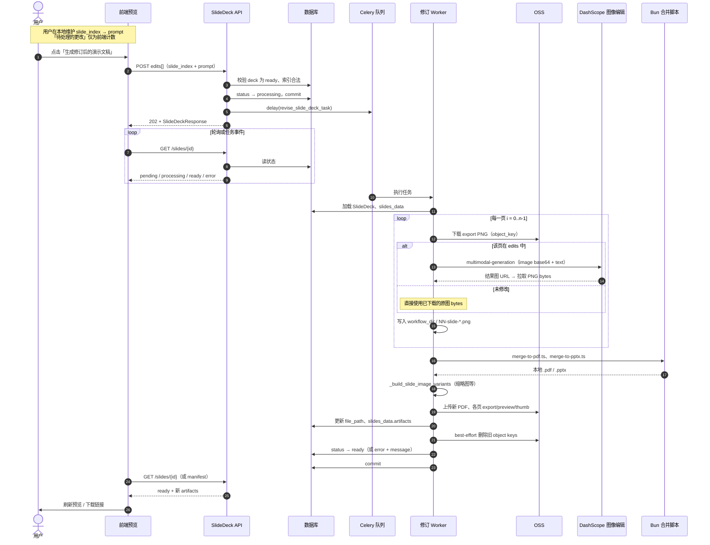

# Slide deck per-page prompt revision (qwen-image-edit) Implementation Plan

> **For agentic workers:** REQUIRED SUB-SKILL: Use superpowers:subagent-driven-development (recommended) or superpowers:executing-plans to implement this plan task-by-task. Steps use checkbox (`- [ ]`) syntax for tracking.

**Goal:** After a slide deck is generated, let the user queue natural-language edits per slide page (multi-slide), see a pending count, then run one job that produces a **new** merged PDF/PPTX and refreshed image manifest while **reusing** unchanged slide images exactly as-is.

**Architecture:** The UI keeps a client-side map `slide_index → prompt` (and optional dropdown listing queued slides). Submitting calls a new API that enqueues a Celery task. The worker downloads each slide’s **export** PNG from OSS (using `object_key` in `slides_data.artifacts.images`), calls DashScope **qwen-image-edit** on only the indices in the map, writes a full ordered set of `NN-slide-*.png` files into `backend/agent/slide_deck/studio/{slide_deck_id}/` (names aligned with merge scripts), reuses existing `merge-to-pdf.ts` / `merge-to-pptx.ts` via `_merge_slide_deck_outputs`, rebuilds variants with `_build_slide_image_variants`, uploads the new PDF and image assets, deletes prior OSS keys best-effort, and sets status back to `ready`. Same `SlideDeck` row is updated (new `file_path` and `slides_data`); this matches “新文件” as new object-storage artifacts without cloning the DB row.

**Tech stack:** FastAPI, Pydantic v2, SQLAlchemy async, Celery, httpx (DashScope HTTP), existing OSS helpers (`download_file_from_obs`, `upload_file_to_obs`), Bun merge scripts under `backend/agent/skills/baoyu-slide-deck/scripts/`, Vue 3 + Vuetify (`SlideDeckPreviewDialog.vue`), existing `studioApi` axios client.

**Reference UI:** Workspace assets `image-d74079d2-58a5-4082-bca8-adf48a132ed7.png` and `image-826b569a-ae77-4788-b908-b4270676707c.png` (bottom sheet: “更改幻灯片 N”, placeholder, “待处理的更改 (M 项)”, “取消”, “生成修订后的演示文稿”).

**DashScope contract (qwen-image-edit):** Same HTTP endpoint as text-to-image: `POST {dashscope_api_base}/services/aigc/multimodal-generation/generation`. Body uses `model: "qwen-image-edit"`, `input.messages[0].content` as an array with **one** `{"image": "<url or data:image/png;base64,...>"}` and **one** `{"text": "<edit instruction>"}` (only one text block). Response shape matches `generate_image_from_prompt` (parse `output.choices[0].message.content[0].image` URL, then GET bytes). See [Alibaba Cloud Qwen image edit API](https://www.alibabacloud.com/help/en/model-studio/qwen-image-edit-api).

## 时序流程图

下列时序图描述用户从「排队多页修改」到「拿到新 PDF / 预览图」的端到端调用顺序（与上文 Architecture 一致）。



---

## File map (create / modify)

| Area | Responsibility |
|------|----------------|
| `backend/app/config.py` | New setting e.g. `dashscope_slide_image_edit_model: str = "qwen-image-edit"` (env `DASHSCOPE_SLIDE_IMAGE_EDIT_MODEL`) so production can swap variants without touching code. |
| `backend/app/services/studio/image_generation_service.py` (or new `qwen_image_edit_service.py`) | `edit_slide_image_bytes(...)` — httpx call with base64 image + text; reuse rate-limit retry pattern from `generate_image_from_prompt`. |
| `backend/app/services/studio/slide_deck_revision_service.py` (new) | Orchestrate: validate deck, build temp/workflow dir file set, call edit per index, merge, upload, cleanup old keys, update `SlideDeck`. |
| `backend/app/tasks/studio_tasks.py` | New Celery task `revise_slide_deck_task`. |
| `backend/app/api/studio/slide_deck.py` | `POST /api/slides/{slide_id}/revise` → 202 + enqueue; reuse rate limit `GenerationKind.SLIDE_DECK` with `artifact_id=slide.id` like `regenerate_slide`. |
| `backend/app/schemas/studio.py` | `SlideDeckReviseRequest`, `SlideDeckSlideEdit` (`slide_index: int`, `prompt: str`). |
| `frontend/src/api/studio.ts` | `reviseSlideDeck(slideId, { edits: [...] })`. |
| `frontend/src/components/studio/SlideDeckPreviewDialog.vue` | “修改” entry, overlay state, pending map, submit/cancel, poll or SSE if already used for slides (match existing deck status refresh). |

---

### Task 1: Schemas and request validation

**Files:**

- Create: `backend/tests/schemas/test_slide_deck_revise_request.py` (if `tests/schemas/` missing, use `backend/tests/test_slide_deck_revise_request.py`)
- Modify: `backend/app/schemas/studio.py` (append models near other SlideDeck schemas)

- [ ] **Step 1: Add Pydantic models**

```python
# backend/app/schemas/studio.py (append near SlideDeck types)
from pydantic import BaseModel, Field, model_validator


class SlideDeckSlideEdit(BaseModel):
    slide_index: int = Field(ge=0, description="0-based index matching manifest order")
    prompt: str = Field(min_length=1, max_length=4000)


class SlideDeckReviseRequest(BaseModel):
    edits: list[SlideDeckSlideEdit] = Field(min_length=1)

    @model_validator(mode="after")
    def dedupe_by_slide(self) -> "SlideDeckReviseRequest":
        by_index: dict[int, str] = {}
        for item in self.edits:
            by_index[item.slide_index] = item.prompt.strip()
        self.edits = [
            SlideDeckSlideEdit(slide_index=i, prompt=p)
            for i, p in sorted(by_index.items())
        ]
        return self
```

- [ ] **Step 2: Failing test for empty prompt after strip**

```python
# backend/tests/test_slide_deck_revise_request.py
import pytest
from pydantic import ValidationError

from app.schemas.studio import SlideDeckReviseRequest, SlideDeckSlideEdit


def test_revise_request_rejects_empty_edits():
    with pytest.raises(ValidationError):
        SlideDeckReviseRequest(edits=[])


def test_revise_request_dedupes_last_prompt_wins():
    body = SlideDeckReviseRequest(
        edits=[
            SlideDeckSlideEdit(slide_index=1, prompt="first"),
            SlideDeckSlideEdit(slide_index=1, prompt="second"),
        ]
    )
    assert len(body.edits) == 1
    assert body.edits[0].slide_index == 1
    assert body.edits[0].prompt == "second"
```

- [ ] **Step 3: Run test**

Run: `cd /Users/t-wangwei07/Downloads/workspacePy/mycode/notebookLM/backend && pytest tests/test_slide_deck_revise_request.py -v`

Expected: PASS after models exist.

- [ ] **Step 4: Commit**

```bash
git add backend/app/schemas/studio.py backend/tests/test_slide_deck_revise_request.py
git commit -m "feat(studio): add slide deck revise request schemas"
```

---

### Task 2: Qwen image edit HTTP helper

**Files:**

- Modify: `backend/app/config.py` (add `dashscope_slide_image_edit_model`)
- Modify: `backend/app/services/studio/image_generation_service.py` or **Create:** `backend/app/services/studio/qwen_image_edit.py` (prefer **new file** to keep `image_generation_service` focused)

- [ ] **Step 1: Config field**

In `Settings` add:

```python
dashscope_slide_image_edit_model: str = Field(
    default="qwen-image-edit",
    validation_alias=AliasChoices(
        "DASHSCOPE_SLIDE_IMAGE_EDIT_MODEL",
        "dashscope_slide_image_edit_model",
    ),
)
```

Document in `config.yaml.example` / `.env.example` one line.

- [ ] **Step 2: Implement `edit_image_with_instruction`**

Use the same URL as `generate_image_from_prompt`. Payload sketch:

```python
import base64

def _png_data_uri(png_bytes: bytes) -> str:
    b64 = base64.standard_b64encode(png_bytes).decode("ascii")
    return f"data:image/png;base64,{b64}"


async def edit_image_with_instruction(
    image_png: bytes,
    instruction: str,
    *,
    title: str = "slide-edit",
) -> bytes:
    model_id = settings.dashscope_slide_image_edit_model.strip()
    # ... same headers as generate_image_from_prompt ...
    payload = {
        "model": model_id,
        "input": {
            "messages": [
                {
                    "role": "user",
                    "content": [
                        {"image": _png_data_uri(image_png)},
                        {"text": instruction.strip()},
                    ],
                }
            ]
        },
        "parameters": {
            "watermark": False,
            # Omit unsupported keys for qwen-image-edit per doc
        },
    }
    # Parse response like generate_image_from_prompt; return PNG bytes
```

If DashScope returns 400 for `parameters.size` on `qwen-image-edit`, keep parameters minimal (only `watermark`).

- [ ] **Step 3: Unit test with httpx.MockTransport** (optional but recommended)

Mock POST returning JSON with one `image` URL; mock GET returning `b"\x89PNG\r\n\x1a\n"` minimal PNG or real tiny fixture.

- [ ] **Step 4: Commit**

```bash
git add backend/app/config.py backend/app/services/studio/qwen_image_edit.py config.yaml.example .env.example
git commit -m "feat(ai): add DashScope qwen-image-edit helper for slide revisions"
```

---

### Task 3: Revision orchestration service

**Files:**

- Create: `backend/app/services/studio/slide_deck_revision_service.py`
- Modify: `backend/app/services/studio/slide_service.py` — export or reuse **public** helpers: `_merge_slide_deck_outputs`, `_build_slide_image_variants`, `_read_optional_text`, `_parse_outline_slides`, `_collect_prompt_artifacts`, `_studio_workflow_dir`, `_upload_slide_deck_pdf`, constants `SLIDE_DECK_V2`, `SKILL_WORKFLOW_NAME` (either import private names in revision service — acceptable in same package — or add thin wrappers `merge_slide_deck_workflow_dir`, `finalize_slide_deck_artifacts` in `slide_service.py`).

Core algorithm:

1. Load `SlideDeck` by id; require `status == ready` and `slides_data.generation_version == "v2"` (or presence of `artifacts.images` list); else raise domain error for API to map to 409.
2. Let `images = slides_data["artifacts"]["images"]` (ordered list). `n = len(images)`.
3. For each edit, assert `slide_index < n` and non-empty prompt.
4. `workflow_dir = _studio_workflow_dir(slide_deck_id)` — `mkdir(parents=True, exist_ok=True)`.
5. For `i` in `0..n-1`:
   - Resolve export `object_key` from `images[i]["variants"]["export"]["object_key"]`.
   - `png = download_file_from_obs(object_key)`.
   - If `i` in edit map: `png = await edit_image_with_instruction(png, prompt, title=f"slide-{i+1}")` (raise if None).
   - Write to `workflow_dir / filename` using the **same basename** as the original slide so Bun merge picks it up. `merge-to-pdf.ts` expects `^(\d+)-slide-.*\.(png|jpg|jpeg)$` sorted by the leading number (`backend/agent/skills/baoyu-slide-deck/scripts/merge-to-pdf.ts`). Use `images[i].get("filename")` from `slides_data` when set; otherwise derive `f"{i+1:02d}-slide-{i+1}.png"` after verifying one real `agent/slide_deck/studio/<id>/` sample in implementation.
6. Call `_merge_slide_deck_outputs(workflow_dir)` → `pdf_path`, `pptx_path`.
7. Thread-pool `_build_slide_image_variants(workflow_dir, slides_meta)`; `slides_meta` from existing `slides_data["slides"]` unchanged.
8. `new_pdf_key = _upload_slide_deck_pdf(pdf_path.read_bytes())`.
9. Collect `old_keys = slide_deck_storage_keys(slide.slides_data, slide.file_path)`.
10. Update `slide.file_path`, `slide.slides_data` (same structure as `_run_slide_deck_generation_v2` tail: `artifacts.images`, `artifacts.pdf`/`pptx` paths as strings, `merge_logs`, keep `generation_version`, `workflow`, `options`, `slides`, `analysis`/`outline`/`prompts` from previous unless you choose to refresh `prompts` — YAGNI: keep prior prompts).
11. After DB flush, `delete_studio_objects_best_effort(old_keys)` (avoid deleting keys you just overwrote if keys collide — they should not, new uploads use new UUID prefixes).

- [ ] **Step 1: Implement `async def run_slide_deck_prompt_revision(session, slide_deck_id, edits: list[tuple[int, str]]) -> SlideDeck`**

- [ ] **Step 2: Error handling:** On any failure after partial OSS upload, set `mark_generation_as_error` or leave deck in `error` with message; document rollback strategy (simplest: status `processing` during task, on exception `error` + message).

- [ ] **Step 3: Commit**

```bash
git add backend/app/services/studio/slide_deck_revision_service.py backend/app/services/studio/slide_service.py
git commit -m "feat(studio): orchestrate slide deck partial image revision"
```

---

### Task 4: Celery task + API route

**Files:**

- Modify: `backend/app/tasks/studio_tasks.py`
- Modify: `backend/app/api/studio/slide_deck.py`
- Modify: `backend/main.py` or Celery autodiscover if needed (follow existing `generate_slide_deck_task` registration)

- [ ] **Step 1: Celery task**

```python
@celery_app.task(bind=True, name="revise_slide_deck")
def revise_slide_deck_task(self, slide_deck_id: str, edits: list[dict]):
    """edits: [{"slide_index": 0, "prompt": "..."}, ...]"""
    from app.database import async_session
    from app.services.studio.slide_deck_revision_service import (
        run_slide_deck_prompt_revision,
    )

    async def _run():
        await publish_task_event("slide", slide_deck_id, "processing")
        async with async_session() as session:
            try:
                await run_slide_deck_prompt_revision(
                    session,
                    slide_deck_id,
                    [(e["slide_index"], e["prompt"]) for e in edits],
                )
                await session.commit()
            except Exception:
                await session.rollback()
                raise
        # publish ready/error like generate_slide_deck_task
    asyncio.run(_run())
```

Mirror exception handling from `generate_slide_deck_task` (lines ~190+ in `studio_tasks.py`).

- [ ] **Step 2: FastAPI route**

```python
@router.post(
    "/api/slides/{slide_id}/revise",
    response_model=SlideDeckResponse,
    status_code=202,
)
async def revise_slide_deck(
    slide_id: str,
    body: SlideDeckReviseRequest,
    db: AsyncSession = Depends(get_db),
    user: User = Depends(get_current_user),
):
    slide = await _get_slide(db, slide_id, user.id)
    if slide.status != SlideDeckStatus.READY.value:
        raise HTTPException(409, detail="Slide deck is not ready for revision")
    # validate indices against len(artifacts.images)
    # rate limit like regenerate_slide
    slide.status = SlideDeckStatus.PROCESSING.value
    clear_generation_error(slide)
    await db.commit()
    await publish_task_event("slide", slide.id, slide.status)
    revise_slide_deck_task.delay(
        slide.id,
        [e.model_dump() for e in body.edits],
    )
    return SlideDeckResponse.model_validate(slide)
```

- [ ] **Step 3: Manual test**

Start API + worker; POST revise with one index; confirm PDF changes only that page visually.

- [ ] **Step 4: Commit**

```bash
git add backend/app/tasks/studio_tasks.py backend/app/api/studio/slide_deck.py
git commit -m "feat(api): enqueue slide deck qwen-image-edit revision"
```

---

### Task 5: Frontend — preview dialog + API

**Files:**

- Modify: `frontend/src/api/studio.ts`
- Modify: `frontend/src/components/studio/SlideDeckPreviewDialog.vue`

- [ ] **Step 1: API method**

```typescript
export interface SlideDeckSlideEditPayload {
  slide_index: number
  prompt: string
}

export interface SlideDeckRevisePayload {
  edits: SlideDeckSlideEditPayload[]
}

// inside studioApi
reviseSlideDeck: async (
  slideId: string,
  data: SlideDeckRevisePayload
): Promise<SlideDeckData> => {
  const res = await client.post(`/slides/${slideId}/revise`, data)
  return res.data
},
```

- [ ] **Step 2: UI behavior**

- Add header button “修改” (only when `deck.status === 'ready'` and manifest loaded).
- Toggle bottom sheet / `v-bottom-sheet` or fixed `v-card` anchored at bottom with:
  - Title: `更改幻灯片 {{ currentSlideNumber }}`
  - `v-textarea` bound to draft prompt for **current** slide index.
  - “加入待处理” or auto-queue on blur: push `pendingEdits.set(index, prompt)`; clear draft when switching slide.
  - Chip/button: `待处理的更改 ({{ pendingCount }} 项)` with `v-menu` listing slide numbers + short prompt preview; allow remove one.
  - “取消” closes sheet and optionally clears pending (confirm if non-empty — YAGNI: clear on cancel).
  - “生成修订后的演示文稿”: call `reviseSlideDeck`, disable while `deck.status !== 'ready'`, show snackbar on 202.
- Reuse existing polling/subscription for slide status if `StudioPanel` or store already listens to `publish_task_event` for `"slide"`; otherwise poll `getSlide(slideId)` until `ready` or `error`.

- [ ] **Step 3: Lint**

Run project lint for touched Vue/TS files.

- [ ] **Step 4: Commit**

```bash
git add frontend/src/api/studio.ts frontend/src/components/studio/SlideDeckPreviewDialog.vue
git commit -m "feat(studio): slide deck multi-page prompt revision UI"
```

---

## Self-review

**1. Spec coverage**

| Requirement | Task |
|-------------|------|
| Per-page prompt edit | Task 5 UI + Task 3 service |
| “修改” opens panel like reference | Task 5 |
| Multiple pages | `edits` list + pending map |
| Pending count | `pendingEdits.size` |
| Generate new deck file | Task 3 merge + upload new PDF/PPTX |
| Unchanged pages unchanged | Task 3 copies bytes from OSS for non-edited indices |
| qwen-image-edit | Task 2 + config |

**2. Placeholder scan:** No TBD/TODO left in plan body.

**3. Type consistency:** `slide_index` is 0-based everywhere (manifest `index` field); UI should use same convention internally and label “幻灯片 N” as `index + 1`.

**Gap / decision:** If product requires a **new DB row** per revision, add `parent_slide_deck_id` migration in a follow-up plan; current plan updates one row (simpler, matches regenerate pattern).

---

## Execution handoff

**Plan complete and saved to `docs/superpowers/plans/2026-05-06-slide-deck-prompt-revision.md`. Two execution options:**

1. **Subagent-Driven (recommended)** — Dispatch a fresh subagent per task, review between tasks, fast iteration. **REQUIRED SUB-SKILL:** superpowers:subagent-driven-development.

2. **Inline Execution** — Execute tasks in this session using executing-plans, batch execution with checkpoints. **REQUIRED SUB-SKILL:** superpowers:executing-plans.

**Which approach?**

**Note:** The Cursor command `/write-plan` is deprecated; for future work ask the assistant to use the **writing-plans** skill so plans land under `docs/superpowers/plans/` with this structure.
